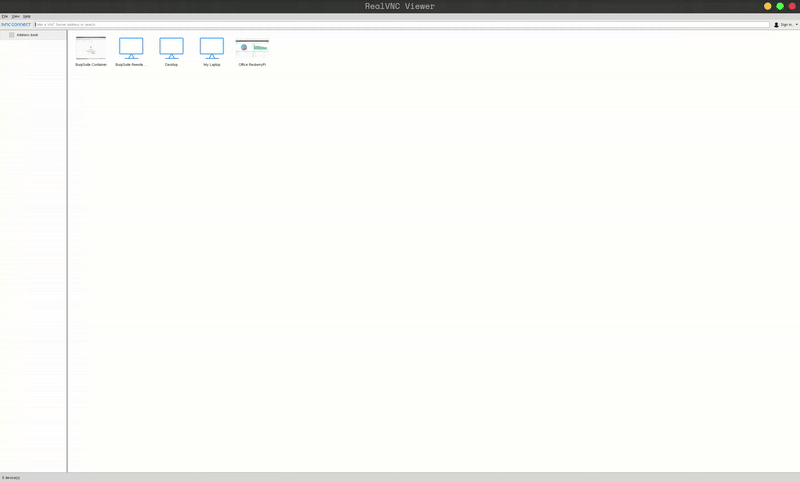
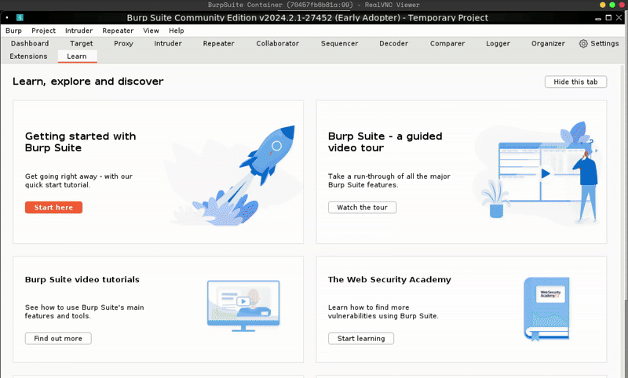
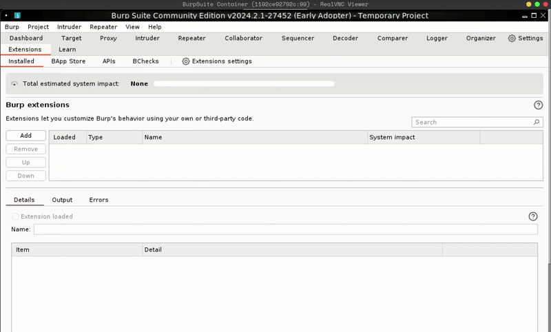

<!-- Guide to run Burpsuite in docker and use it from host machine

### Create a .env file in the root folder

Example ENV:
```shell
BURP_PROXY_PORT=8080
BURP_VNC_PORT=5900
```


### Run the burpsuite container

```shell
docker-compose up --build -d
```

### Install RealVNC Viewr or any VNC Client of you choice

Real VNC Download: [RealVNC](https://www.realvnc.com/en/connect/download/viewer/?lai_vid=99nxv0mpKtjKM&lai_sr=0-4&lai_sl=l)


## Connect to Burpsuite docker using VNC Viewer
### Connect Real VNC :



1. Click on the "New Connection" from top-left menu
2. Add the burpsuite vnc server : example : `127.0.0.1:5900` and add any name to the connection
3. "Ok" button, then you will be asked for password to conenct 

*The Password for Burpsuite VNC default is: `1234`*


### Setup Burpsuite


1. Start a new temporary project in burpsuite 
2. Set the proxy to all the interface
3. Enable "Force use to TLS"
4. Setup `Jython` path in extension to run python script file in extension

## Add your python extension



You can add your python script file for extension in the `extensions` folder (since this folder is mounted with docker container)


### Test proxy from your host machine 
```shell
curl --proxy http://localhost:8080 https://example.com -k
```

And this request should be seen in the "Http History" srction with in "Proxy" -->


## 🛡️ Guide to Run Burp Suite in Docker and Use It from Host Machine

1. 📁 Create a .env File in the Project Root

Create a file named .env and add:

```env
BURP_PROXY_PORT=8080
BURP_VNC_PORT=5900
```

These will be used in docker-compose to expose Burp’s proxy and VNC ports.

2. 🐳 Run the Burp Suite Container

From the project root (where docker-compose.yml is located):

```bash
docker-compose up --build -d
```

3. 🔍 Install RealVNC Viewer (or any VNC client)

Download: RealVNC Viewer

👉 [https://www.realvnc.com/en/connect/download/viewer/](https://www.realvnc.com/en/connect/download/viewer/)

This lets you access Burp’s GUI running inside the Docker container.

4. 🖥️ Connect to Burp Suite via VNC

Use the VNC client:

📸 Connect RealVNC (demo):


Steps:

1. Click “New Connection” in VNC Viewer
2. Enter the VNC address: 127.0.0.1:5900
3. Assign a name and click OK
4. Enter password when prompted

🗝 Default password: 1234

5. ⚙️ Configure Burp Suite (First Time Setup)

📸 Initial Setup Demo:


Steps:

1. Start a Temporary Project in Burp

2. Go to Proxy → Options → Proxy Listeners

   * Set the interface to All Interfaces (0.0.0.0:8080)

3. Enable Force TLS in Proxy → Options → TLS

4. Go to Extender → Options → Python Environment

   * Set path to /opt/jython/jython-standalone.jar

5. 🧩 Add Your Python Extension

Place your custom Python file in the extensions/ folder (mounted inside the container).

📸 Adding Python Extension:


Steps:

1. Go to Extender → Extensions → Add

2. Choose Extension Type: Python

3. Browse: Select your script inside /opt/burp\_extensions/

4. Click Next to load it

5. 🔍 Test Proxy from Host Machine

Example curl test:

```bash
curl --proxy http://localhost:8080 https://example.com -k
```

The -k flag allows skipping SSL verification (since Burp uses a self-signed cert).

🧠 You should now see the request inside Burp under:
Proxy → HTTP history

🎉 Done! You now have a working Burp Suite setup in Docker with proxying support for host applications and custom Python extensions.

Let me know if you’d like this exported as a README.md or formatted into a PDF guide.
